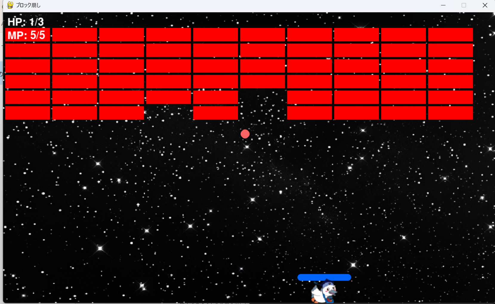

# ブロック崩し

## 実行環境の必要条件
* python >= 3.10
* pygame >= 2.1

## ゲームの概要
* 画面上を反射さしながら移動するボールを、バーで打ち返して、ブロックを消していくゲーム。
* 参考URL：[PythonとPygameでブロック崩しゲームを作る](https://qiita.com/Tadataka_Takahashi/items/9affa69ca6c70564587c)

## ゲームの遊び方
* 画面下部にボールが落ちないように、バーを操作してブロックを壊していくシンプルなゲーム
* バーの操作は右下の十字キー
* 全部ブロックを消したらクリア
* HP（残りのボールの数）が０になったらゲームオーバー
* こうかとんにボールが当たったらゲームオーバー
## ゲームの実装
* HPを表示する（3/3）= 数字は残りの玉の数
・MPを表示する（5/5）
　⇒1MP使って10秒加速（spaceキー押下）
　⇒5MP使って貫通して崩す、貫通の終了条件：ボールを落とす or　バーでボールを弾く(Enter)
* りんごを降らせてキャッチできればHPを１増やす。
* バーを実装
　こうかとんに衝突したら爆発
* 反射するボールの実装
* ブロックを実装する
* BGM

### 共通基本機能
* 背景画像
* 反射するボールの実装
* バーを実装する。
* HPを表示する（3/3）数字は残りの玉の数
  MPを表示する（5/5）
### 分担追加機能
* 1MP使って加速（10秒）担当：西田

* 5MP使って貫通できるようになる。担当：鈴木

* りんご（仮）を降らせてキャッチできればHPを１増やす。担当：早坂

* ブロックを実装する。担当：加瀬

* ゲームオーバー画面とクリア画面　担当：白幡

* こうかとんに当たったら爆発機能　担当：加瀬

### ToDo
- [ ] 時間経過でブロックが下に降りてくる（増える）。ある地点まで降りてきてしまったらゲームオーバー
- [ ] （エイリアン（ブロックが降ってくる際に確率で出現）※エイリアンは３回当てないと消えない

### メモ
クラスを作ること。

### 画像
• 